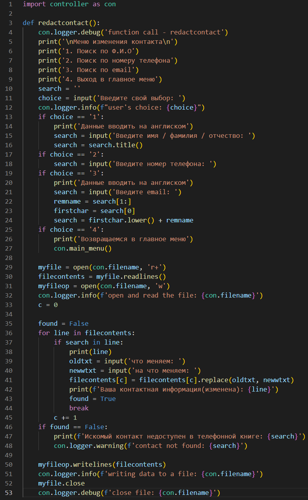

# Телефонная книга

## Описание:
>Простое консольное приложение для работы с игрушечной базой данных. Оно представлено в виде телефонной книги. Приложение позволяет: искать, вносить, изменять и удалять данные о контактах (данные хранятся в отдельном текстовом файле). Все исполняемые файлы находятся в папке calculator_files. Данные работы калькулятора хранятся в файле my.log

Над данным приложением работал Смирнов Н.Г.

## Архитектура приложения:

### Блок-схема работы модулей

## 1. Модуль - main

### main - является точкой входа, с которой начинается запуск приложения, через импортированные данные модуля (controller).

## 2. Модуль - controller

>### controller - основной модуль программы куда импортируются данные всех нижеперечисленных модулей (log, searchcont, newcont, redactcont, delitcont) для: использования в функции main_menu, видения журнала логирования и ведения мини базы данных (myphonebook).

### Сначала объявляем файл телефонной книги(myphonebook.txt) для хранения информации о контактах, он и является нашей "базой данных", а после создаём основную функцию для изменения, поиска и удаления контактов телефонной книги. Функция main_menu представлена в виде рекурсии, где расположено основное меню. В зависимости от введённого номера позиций будет выполнятся обращение к функциям из других модулей (или в случае позиций 1 и 6 выполняются прямо на месте). По завершению работы модулей идёт запись полученных данных в текстовый файл myphonebook.txt, а также повторная активация функции main_menu, что возвращает нас к выбору позиций в главное меню, и так до тех пор, пока не будет введена позиция 6, она и закроет наше приложения (с помощью print).

## 3. Модуль - log

### log - модуль необходимый для видения журнала логов (от выполненных функций и алгоритмов до ошибок в коде приложения).
### Настройка логера:

* Место и название файла, где будут хранится данные, собранные со всех рабочих модулей.
* Формат логирования.
* Объявление переменной logger через которую будет проводится логирование.

### Настроенный модуль log импортируется в controller для последующего использования во всех остальных модулях.

## 4. Модуль - searchcont

### searchcont - используется для поиска контактов из базы данных. Выводимые контакты могут быть от одного до нескольких в зависимости от схожести данных.

### Функция, представленная в модуле, использует схожую структуру меню с модулем controller для удобства использования. В зависимости от выбранной позиции выполняется:
1. Поиск по Ф.И.О - фамилию, имя и отчество можно вводить отдельно (но учтите, что при схожести данных могут быть найдены несколько похожих контактов).
2. Поиск по номеру телефона - ввод номера телефона рекомендуется вводить полностью.
3. Поиск по email - ввод email можно писать не до конца, но, как и в случае с Ф.И.О могут высветится несколько схожих контактов.
4. Выход в главное меню - в случае если выбрали не тот пункт в главном меню, можно вернуться обратно и выбрать другой вариант.
### Полученные данные проходятся циклом for по базе данных до тех пор, пока не найду сходство данных, и тогда поиск завершается. После работы цикла результат выводится на консоль, а также завершается работа модуля.

## 5. Модуль - newcont

### newcont - нужен для записи новых контактов в базу данных. Модуль состоит из четырёх функций. Первые три являются вводом Ф.И.О. Они вводятся отдельно, чтобы скорректировать полученные данные (каждое введённое слово должно быть с заглавной буквы). В четвёртой функции вводятся все остальные данные (номер телефона и email), а также все предыдущие данные объединяются для формирования нового контакта.
### По завершению создания контакта результат выводится на консоль, а также завершается работа модуля.

## 6-7. Модуль - redactcont и delitcont

### * redactcont

### * delitcont

### redactcont и delitcont - почти идентичны друг к другу, и к модулю searchcont, из-за необходимости каждый раз искать нужный контакт в базе данных.

### A) redactcont - по завершению поиска нужного контакта объявляется две переменные oldtxt и newwtxt. В первую пользователь вводит что хочет заменить, а во вторую на что заменить. С помощью метода replace и прошлых двух переменных (oldtxt, newwtxt) найденный контакт редактируется. По завершению работы модуля, данные записываются в базу данных.

### B) delitcont - по завершению поиска нужного контакта идёт обращение к оператору del (filecontents[c]) и контакт удаляется из базы данных. По завершению работы модуля, данные записываются в базу данных.
